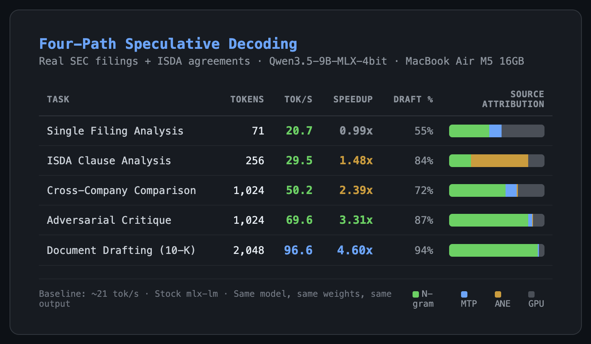

> ## ⚠️ ARCHIVED — Llama-stack predecessor of the current Qwen-stack architecture
>
> four-path-mlx documented the multi-source heterogeneous speculative decoding
> measurements on the **Llama 3.1 stack** (CPU N-gram + ANE 1.7B + MTP head + GPU 9B).
> Those measurements stand as historical evidence of how heterogeneous spec
> decode performs across four concurrent draft sources on Apple Silicon.
>
> The current production stack uses **Qwen 2.5-72B-Instruct-4bit** as the
> verifier on a different architecture, documented here:
> - [`ngram-engine`](https://github.com/MidasMulli/ngram-engine) — current Qwen 72B spec decode server with N-gram drafter (truncate-on-miss, K=16) and MLX prefix KV cache. Model-based drafters are dead on this verifier (EAGLE killed on quantized hidden states, sub-1B cross-family drafters killed on the 90× size gap, PARD killed on parallel-from-single-state architecture).
> - [`orion-ane`](https://github.com/MidasMulli/orion-ane) — the Midas agent that uses the Qwen verifier
>
> **This repository is preserved for the Llama-stack measurements.** The
> drafter findings here informed the conclusions in the current ngram-engine
> repo about which drafter classes are dead on quantized verifiers.
>
> ---
>
# Four-Path Speculative Decoding on Apple Silicon

Four prediction sources, three processors, one generate loop. Measured 1-4.6x speedup on financial document tasks. Same model, same weights, same output.



## How it works

Standard LLM inference uses one processor (GPU) generating one token at a time. This system uses multiple draft sources across three processors to predict tokens before the GPU verifies them:

| Source | Processor | What it catches | Cost |
|--------|-----------|----------------|------|
| **Prompt lookup** | CPU | Subsequences from the prompt itself | Nanoseconds |
| **N-gram hash** | CPU | Pattern echoes from generated context | Nanoseconds |
| **MTP head** | GPU (piggybacks on forward pass) | Next-next token from hidden states | Marginal |
| **GPU 9B** | GPU | Everything else (novel tokens) | Full forward pass |

The sources fire in priority order. If prompt lookup or N-gram has a chain, verify the whole chain in one forward pass. If MTP predicted a token, verify that. GPU generates normally only when nothing cheaper had a prediction.

On domain-specific text, most of what an LLM generates is predictable by something much cheaper than a 9 billion parameter forward pass.

## Results

All benchmarks: MacBook Air M5, 16GB unified memory, macOS 26.3 (Tahoe). Model: Qwen3.5-9B-MLX-4bit via MLX 0.31.1. Baseline: ~21 tok/s on stock mlx-lm with the same model, same prompts, same hardware, greedy decoding. Single-run measurements — expect ±10-15% variance across runs (baseline varies ±2-3 tok/s, speedup ratios shift proportionally).

### Standalone benchmarks (no agent, no tool calling)

Benchmarked on real SEC filings pulled from EDGAR and ISDA derivatives documentation:

| Task | Tokens | tok/s | Speedup | N-gram | PLD | MTP | GPU | Draft % |
|------|--------|-------|---------|--------|-----|-----|-----|---------|
| Single Filing Analysis | 71 | 20.7 | 0.99x | 30 | 0 | 9 | 32 | 55% |
| Cross-Company Comparison | 1,024 | 50.2 | 2.39x | 603 | 0 | 120 | 291 | 72% |
| Adversarial Critique | 1,024 | 69.6 | 3.31x | 846 | 0 | 39 | 129 | 87% |
| Document Drafting (10-K MD&A) | 2,048 | 96.6 | 4.60x | 1,907 | 0 | 16 | 115 | 94% |
| Batch Classification (JSON) | 1,024 | 129.7 | 6.15x (best case) | 937 | 0 | 7 | 70 | 93% |

Source columns show token counts per source. Totals may be ~1% below stated token count due to initial prompt tokens before drafting engages. Batch classification hits 6.15x because structured JSON repeats field names across entries — N-gram eats the schema repetition. This is a best case, not a typical case.

### Agent with tool calling (real-world usage)

When running as the Midas agent server (system prompt, tool definitions, conversation history):

| Task | tok/s | Speedup | PLD | N-gram | GPU | Draft % |
|------|-------|---------|-----|--------|-----|---------|
| ISDA clause analysis (echo-heavy) | 108.5 | 4.3x | 6 | 66 | 11 | 87% |
| CSA walkthrough | 24.7 | 1.0x | 0 | 2 | 248 | <1% |
| Analytical (novel) | 24.6 | 1.0x | 0 | 0 | 200 | 0% |
| Multi-turn conversation | 25.0 | 1.0x | 0 | 0 | 200 | 0% |
| Code generation | 25.1 | 1.0x | 0 | 0 | 200 | 0% |

**The floor is ~1x.** On novel analytical text, code, or conversation with no reference context, no draft source has fuel and performance matches baseline. This is by design — the system adds negligible overhead when drafting fails.

### What determines the speedup

Speedup scales with: (1) generation length, (2) repetition structure of the input, and (3) overlap between output and prompt. ISDA Master Agreements have 60% cross-document repetition at n=8. 10-K filings are lower but within-prompt echoing fuels the hash table on long generations.

**Not copy-paste:** 0% verbatim overlap between generated output and reference documents (verified via SequenceMatcher). The model generates novel text. The draft sources just predict what it's going to say.

**Qwen3.5-9B is a hybrid model** — every layer contains a GatedDeltaNet SSM (31% of per-layer compute) that processes tokens sequentially. This partially explains the 0.96x floor on code generation: when draft acceptance is low, the sequential SSM cost dominates and verification overhead exceeds the savings. Pure attention models would have a higher floor because their verification is fully parallelizable via NAX.

### Batch verification plateau

The key hardware insight: verifying K=32 draft tokens costs the same as K=16, and K=8 is actually MORE expensive due to a GatedDeltaNet SSM batch processing threshold.

| Draft tokens (K) | Verify time (ms) | Std (ms) | n |
|-------------------|-------------------|----------|---|
| 1 | 39.3 | 0.7-6.1 | 100 |
| 4 | 78.4 | 0.2-18.8 | 100 |
| **8** | **149.7** | 0.9-10.4 | 100 |
| 16 | 117.5 | 0.4-15.8 | 100 |
| 24 | 120.3 | 0.5-9.3 | 100 |
| **32** | **117.7** | 0.8-16.4 | 100 |

Statistically validated: 20 runs × 5 prompts × 6 K values = 600 measurements. Full methodology and raw data in [`validation/`](validation/).

**K=8 inversion:** K=8 (149.7ms) costs 27.4% more than K=16 (117.5ms). The GatedDeltaNet SSM batch processing mode activates between K=8 and K=16. Below this threshold, the sequential recurrence dominates each layer's cost. Above it, the parallel linear projections (which are the bulk of per-layer compute) amortize across tokens via NAX.

**K=32 plateau:** K=32/K=16 = 1.002x. The weight load dominates — additional tokens ride the same memory fetch. Theoretical throughput ceiling at K=32: 272 tok/s (11.8x baseline). Measured wall-clock with warm N-gram on CSA drafting: **143.9 tok/s (6.26x)**.

**Important caveat:** Full-model verification includes the 31% sequential GatedDeltaNet overhead — each SSM layer processes tokens sequentially regardless of batch size. Pure attention models (e.g., Llama 70B) would show a flatter plateau because attention is fully parallelizable via NAX. See [orion-ane/nax-probe/FINDINGS.md](https://github.com/MidasMulli/orion-ane/blob/main/nax-probe/FINDINGS.md) for the hardware-level NAX measurements.

## Architecture

```
                    ┌─────────────┐
                    │  Prompt      │
                    └──────┬──────┘
                           │
         ┌─────────────────┼─────────────────┐
         │            │         │             │
   ┌─────▼─────┐ ┌───▼───┐ ┌──▼──┐  ┌ ─ ─ ─▼─ ─ ─ ┐
   │  N-gram   │ │  PLD  │ │ GPU │    ANE (0.8B)
   │  CPU hash │ │  CPU  │ │ MTP │  │  optional,   │
   │  table    │ │lookup │ │head │    same-family
   └─────┬─────┘ └───┬───┘ └──┬──┘  └ ─ ─ ─┬─ ─ ─ ┘
         │            │        │             │
         └────────────┼────────┴─────────────┘
                      │
               ┌──────▼──────┐
               │   Verify    │
               │  (GPU 9B)   │
               └──────┬──────┘
                      │
               ┌──────▼──────┐
               │   Output    │
               └─────────────┘
```

## Quick start

### As an MLX server (drop-in replacement for mlx-lm)

```bash
git clone https://github.com/MidasMulli/four-path-mlx.git
cd four-path-mlx

# Start the server (port 8899, same API as mlx-lm server)
python server/server.py

# It auto-detects available paths:
#   Prompt lookup: always on
#   N-gram: always on
#   MTP: if ~/models/Qwen3.5-9B-MLX-4bit-MTP weights exist
#   GPU: always on
```

The server exposes `/v1/chat/completions` and `/v1/models`. Any OpenAI-compatible client works. Your existing code doesn't change.

### In Python

```python
from mlx_lm import load
from four_path.generate import FourPathDrafter, four_path_generate_step
from four_path.ngram import NgramPredictor
import mlx.core as mx

model, tokenizer = load("mlx-community/Qwen3.5-9B-MLX-4bit")

prompt = "Draft an ISDA Schedule Part 1..."
tokens = tokenizer.encode(prompt)
prompt_mx = mx.array(tokens, mx.uint32)

drafter = FourPathDrafter(ngram_n=8)

for tok, logprobs, from_draft, source in four_path_generate_step(
    prompt_mx, model, drafter, tokenizer=tokenizer,
    max_tokens=1024,
):
    print(tokenizer.decode([tok]), end="", flush=True)
```

### Adding MTP (optional, +0.3x on generation tasks)

```python
from four_path.mtp_patch import patch_mtp

model, tokenizer = load("mlx-community/Qwen3.5-9B-MLX-4bit")
patch_mtp(model, "~/models/Qwen3.5-9B-MLX-4bit-MTP")
# model now has mtp_forward() - four_path_generate_step uses it automatically
```

MTP weights are from the Qwen3.5-9B model's own MTP heads, converted via mlx-lm. The patch loads them at runtime onto stock mlx-lm without needing any fork.

## Running the benchmarks

```bash
# Real-world benchmark (pulls 10-K filings from EDGAR)
python benchmarks/realworld.py

# Standalone ISDA benchmarks (requires sample files in benchmarks/samples/)
python benchmarks/four_path.py

# Full ablation (all individual paths + combinations)
python benchmarks/all_paths.py
```

Benchmark prompts are included in `benchmarks/samples/` (ISDA Master Agreements, 10-K filings from JPM/GS/BAC/ZION, S-1 filings from RDDT/INST/KVYO).

## Key findings

1. **Naive cascading beats smart routing** on consumer hardware. We tested adaptive orchestration (throttle underperforming sources) and multi-check recovery (re-verify at rejection points). Both hurt performance. When verification costs ~50ms, the overhead of routing logic exceeds the savings.

2. **Speedup is task-dependent, not domain-dependent.** The same model on the same domain can range from 1x to 4.6x depending on how much of the output echoes the input. Boilerplate generation and structured output get the most benefit. Novel analytical text gets ~1x.

3. **MTP catches what others miss.** The model's own MTP head uses hidden states from the current forward pass. It has the highest per-token accuracy of any draft source but only produces one token per round. It fills gaps between N-gram chains.

4. **The batch verification plateau is the core insight.** Verifying 32 draft tokens costs the same as 16 on M5 Air — and K=8 is actually the worst point on the curve (149.7ms vs 117.7ms at K=32). [Statistically validated](validation/) with 600 measurements (20 runs × 5 prompts × 6 K values). Hardware evidence: [NAX probe measurements](https://github.com/MidasMulli/orion-ane/blob/main/nax-probe/FINDINGS.md) show quantized 4-bit matmul costs only 1.14x at N=32 vs N=1.

## ANE draft source (experimental)

The architecture supports an ANE draft path but cross-tokenizer models don't work for speculative decoding:

**Cross-family (Qwen3 1.7B, 151K vocab → Qwen3.5 9B, 248K vocab):** 60% teacher-forcing acceptance, but 0% autoregressive acceptance. The different tokenizers cause token boundary misalignment — same text produces different token counts, breaking cache synchronization between draft and target. This is structural, not an implementation bug.

**Same-family ([gdn-coreml](https://github.com/MidasMulli/gdn-coreml) — Qwen3.5-0.8B, same 248K vocab):** 56-70% teacher-forcing acceptance, 37-59% autoregressive acceptance (varies by prompt type). The tokenizer matches, so cache sync works. However, on M5 Air 16GB the 0.8B at 24ms/tok is only 1.75x faster than the 9B at 42ms/tok — insufficient speed ratio for speculative decoding to break even. Measured 0.94x wallclock (slower than baseline).

**On 64GB Pro with 70B target:** 0.8B at 24ms/tok vs 70B at ~200ms/tok = 8x speed ratio, in the spec decode sweet spot. The converter was built for this configuration.

## Future work

- 64GB M5 Pro: 70B target model where early-exit self-speculation saves 50% per draft and batch verify gains are proportionally larger
- Same-family ANE draft (Qwen3.5-0.8B via gdn-coreml) on Pro hardware
- Tree-based verification (STree) for SSM/hybrid models
- EAGLE-3 trained draft heads for analytical text where N-gram/PLD have no fuel

## Hardware

Built and tested on MacBook Air M5, 16GB unified memory, 10 GPU cores, macOS 26.3 (Tahoe), MLX 0.31.1, mlx-lm 0.31.1.

## Prior work

- N-gram hash table based on llama.cpp's ngram-mod algorithm (LCG hash, 4M entries)
- MTP heads from [ml-explore/mlx-lm PR #990](https://github.com/ml-explore/mlx-lm/pull/990) (AirRunner), loaded at runtime via `mtp_patch.py`
- Prompt lookup decoding adapted from HuggingFace/llama.cpp implementations

## Related

- [orion-ane](https://github.com/MidasMulli/orion-ane) — ANE training + persistent memory daemon + agent framework + [NAX hardware probe](https://github.com/MidasMulli/orion-ane/blob/main/nax-probe/FINDINGS.md)
- [gdn-coreml](https://github.com/MidasMulli/gdn-coreml) — GatedDeltaNet SSM to CoreML converter (same-family ANE draft source)
- [ane-perf](https://github.com/MidasMulli/ane-perf) — ANE hardware performance characterization via IOReport bandwidth histograms
- [dual-path-inference](https://github.com/MidasMulli/dual-path-inference) — Initial GPU+ANE concurrency proof-of-concept (archived)

## License

MIT
